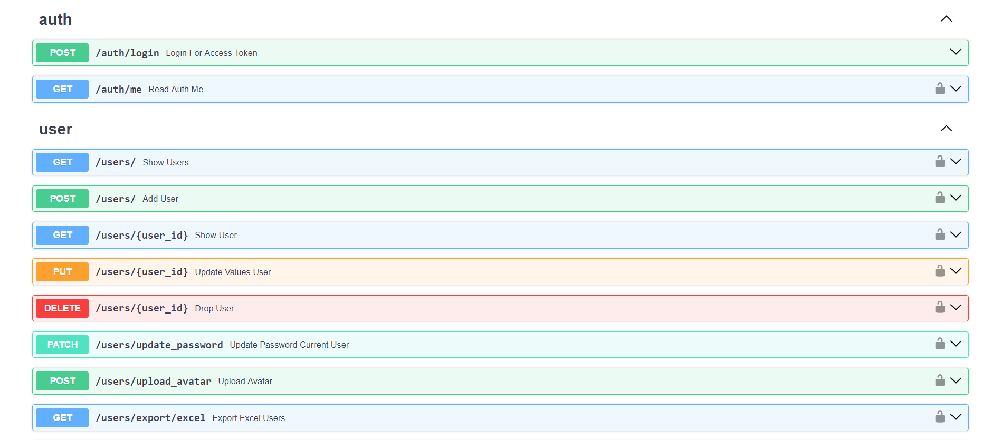

  

    <em>FastAPI framework, high performance, easy to learn, fast to code, ready for production</em>

---

Application made with FastAPI that consists of the creation of a CRUD of a user and system authentication api that contains the following functionalities:
<ul>
  <li>Relationships between different models.</li>
  <li>Primary key format UUID.</li>
  <li>Contains endpoints of type GET, POST, PATCH, PUT and DELETE</li>
  <li>Generate token by JWT (Json web tokens)</li>
  <li>Postman collection.json file to import and create use endpoints.</li>
  <li>Requests validations.</li>
  <li>Exception handling.</li>
  <li>Email sending notification to verify the user.</li>
  <li>Enums.</li>
  <li>Middleware.</li>
  <li>Dependencies validations.</li>
  <li>File Storage.</li>
  <li>Exports in Excel and PDF format.</li>
  <li>Jinja2 Email Templates.</li>
  <li>Multi language support.</li>
  <li>Migration file to create all the tables in the database.</li>
  <li>Seeders are in JSON format.</li>
  <li>Python 3.12</li>
  <li>Users contain different roles and permissions.</li>
  <li>The project contains the files to deploy it in Docker.</li> 
</ul> 

<h3>Headers</h3>
<table>
<thead>
<tr>
<th>Key</th>
<th>Value</th>
</tr>
</thead>
<tbody>
<tr>
<td>Authorization</td>
<td>{Token provided by JWT}</td>
</tr>
<tr>
<td>Accept</td>
<td>application/json</td>
</tr>
<tr>
<td>Content-Type</td>
<td>application/json</td>
</tr>
<tr>
<td>Accept-Language</td>
<td>application/json</td>
</tr>
</tbody>
</table>

<h3>Setup</h3>
<pre>
<code>$ apt-get install wkhtmltopdf</code>
</pre>
<pre>
<code>$ cp .env.example .env.dev</code>
</pre>
<pre>
<code>$ pip install --no-cache-dir --upgrade -r requirements.txt</code>
</pre>
<pre>
<code>$ sed -i '/JWT_SECRET_KEY=""/d' .env.dev && jwt_secret_key="JWT_SECRET_KEY=$(openssl rand -hex 32)" && sed -i -e "22i$jwt_secret_key" .env.dev</code>
</pre>
<pre>
<code>$ fastapi run app/main.py --port 8000 --reload</code>
</pre>

<h3>User admin credentials</h3>
User: <b>admin@email.com</b> 
Password: <b>Pass-1234</b>

 OpenAPI documentation: <a href="http://localhost:8000/docs" target="_blank">http://localhost:8000/docs</a>

<h3>Endpoints Auth:</h3>
<table>
<thead>
<tr>
<th>Method</th>
<th>Path</th>
<th>Description</th>
<th>Auth</th>
<th>Is Admin</th>
</tr>
</thead>
<tbody>
<tr>
<td>POST</td>
<td>/auth/login</td>
<td>Login a user</td>
<td>No</td>
<td>No</td>
</tr>
<tr>
<td>GET</td>
<td>/auth/me</td>
<td>Check if user authenticated</td>
<td>Yes</td>
<td>No</td>
</tr>
</tbody>
</table>

<h3>Endpoints Users:</h3>
<table>
<thead>
<tr>
<th>Method</th>
<th>Path</th>
<th>Description</th>
<th>Auth</th>
<th>Is Admin</th>
</tr>
</thead>
<tbody>
<tr>
<td>GET</td>
<td>/users</td>
<td>Get all the users</td>
<td>Yes</td>
<td>No</td>
</tr>
<tr>
<td>GET</td>
<td>/users/{id}</td>
<td>Get a user</td>
<td>Yes</td>
<td>No</td>
</tr>
<tr>
<td>POST</td>
<td>/users</td>
<td>Add new user</td>
<td>Yes</td>
<td>Yes</td>
</tr>
<tr>
<td>PUT</td>
<td>/users/{id}</td>
<td>Update a user</td>
<td>Yes</td>
<td>Yes</td>
</tr>
<tr>
<td>PATCH</td>
<td>/users/update_password</td>
<td>Update password current user</td>
<td>Yes</td>
<td>No</td>
</tr>
<tr>
<td>DELETE</td>
<td>/users/{id}</td>
<td>Delete a user</td>
<td>Yes</td>
<td>Yes</td>
</tr>
<tr>
<td>GET</td>
<td>/users/export/excel</td>
<td>Export all users in Excel format</td>
<td>Yes</td>
<td>Yes</td>
</tr>
<tr>
<td>GET</td>
<td>/users/export/pdf</td>
<td>Export all users in Pdf format</td>
<td>Yes</td>
<td>Yes</td>
</tr>
<tr>
<td>GET</td>
<td>/users/confirm_email/{hash}</td>
<td>Confirm verification user</td>
<td>No</td>
<td>No</td>
</tr>
<tr>
<td>GET</td>
<td>/users/resend/confirm_email</td>
<td>Resend email verification user</td>
<td>Yes</td>
<td>No</td>
</tr>
</tbody>
</table>

<h3>Endpoints Roles:</h3>
<table>
<thead>
<tr>
<th>Method</th>
<th>Path</th>
<th>Description</th>
<th>Auth</th>
<th>Is Admin</th>
</tr>
</thead>
<tbody>
<tr>
<td>GET</td>
<td>/roles</td>
<td>Get all the roles</td>
<td>Yes</td>
<td>Yes</td>
</tr>
<tr>
<td>GET</td>
<td>/roles/{id}</td>
<td>Get a role</td>
<td>Yes</td>
<td>Yes</td>
</tr>
</tbody>
</table>

 

 

<h2>Configure values in the .env.dev file</h2>

<pre><code>
<strong>APP_URL="http://localhost:8000"</strong>
</code></pre>

<pre><code>
<strong>DB_DRIVER=""</strong>
<strong>DB_HOST=""</strong>
<strong>DB_PORT=""</strong>
<strong>DB_DATABASE=""</strong>
<strong>DB_USERNAME=""</strong>
<strong>DB_PASSWORD=""</strong>
</code></pre>

<pre><code>
<strong>MAIL_SERVER=""</strong>
<strong>MAIL_PORT=""</strong>
<strong>MAIL_USERNAME=""</strong>
<strong>MAIL_PASSWORD=""</strong>
<strong>MAIL_FROM_ADDRESS=""</strong>
<strong>MAIL_FROM_NAME=""</strong>
<strong>MAIL_STARTTLS=""</strong>
<strong>MAIL_SSL_TLS=""</strong>
<strong>MAIL_USE_CREEDENTIALS=""</strong>
</code></pre>

<pre><code>
# command generate JWT_SECRET_KEY: openssl rand -hex 32
<strong>JWT_SECRET_KEY=""</strong>
<strong>JWT_ALGORITHM=""</strong>
</code></pre>

 

<h2>Deploy to Docker <g-emoji class="g-emoji" alias="whale" fallback-src="https://github.githubassets.com/images/icons/emoji/unicode/1f433.png">🐳</g-emoji></h2>

Docker repository: <a href="https://hub.docker.com/r/javi98/python-api-crud-template" target="_blank">https://hub.docker.com/r/javi98/python-api-crud-template</a>

<h4>Containers:</h4>
<ul>
<li>python:3.12 - <code>:8000</code></li>
<li>mariadb:11.2.2 - <code>:3306</code></li>
<li>phpmyadmin:5.2.1 - <code>:8085->80/tcp</code></li>
<li>mailhog:v1.0.1 - <code>:1025 # smtp server</code> <code>:8025 # web ui</code>
</ul>

<h4>Containers structure:</h4>

<pre>├── python-api-crud-template-app
├── python-api-crud-template-db
├── python-api-crud-template-smtp
└── python-api-crud-template-phpmyadmin</pre>

<h4>Setup:</h4>
<pre>
<code>$ git clone https://github.com/JAVI-CC/python-api-crud-template.git
$ cd python-api-crud-template
$ cp .env.example .env.dev
$ docker compose up -d
$ docker compose exec app chmod +x ./run.sh
$ docker compose exec app ./run.sh</code>
</pre>

 

Once you have the containers deployed, you can access the API at  <a href="http://localhost:8000" target="_blank">http://localhost:8000</a>